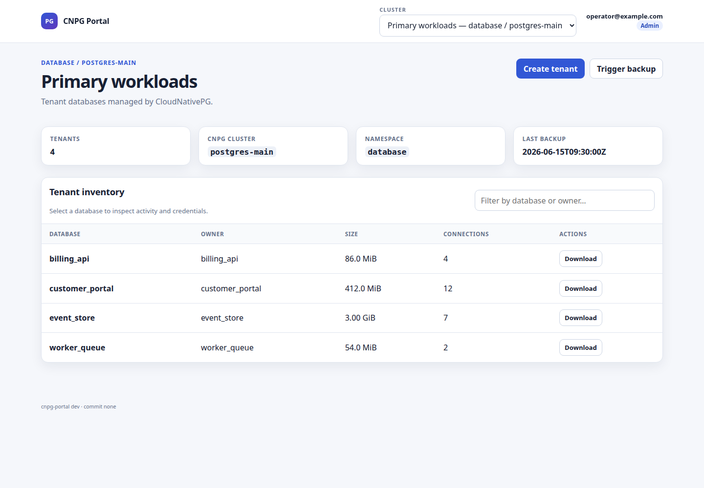
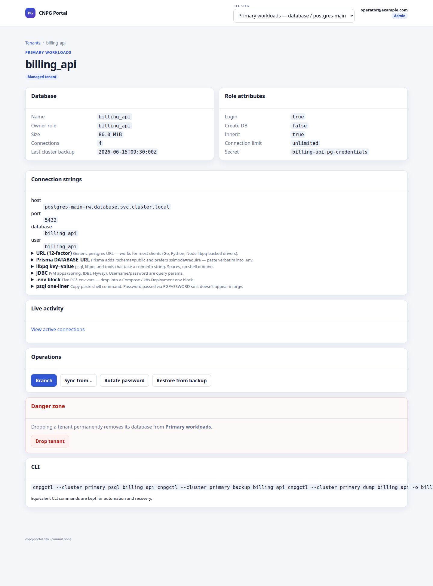
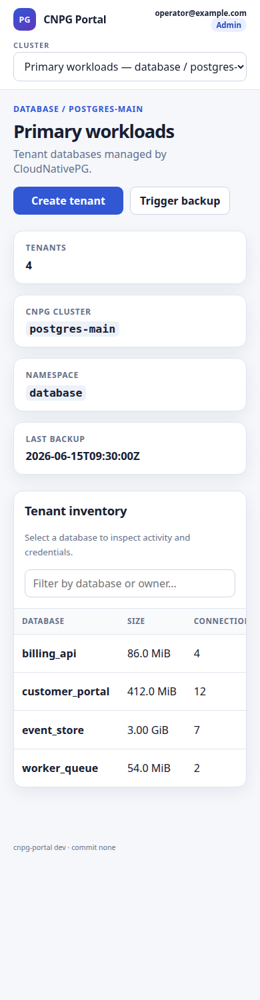

# cnpg-portal

A small self-service DB platform on top of [CloudNativePG](https://cloudnative-pg.io/).
A single Go binary (`cnpgctl`) provides a CLI and a web UI for daily
PostgreSQL tenant operations: create / list / branch / rotate / dump /
restore / drop, plus a connection-string copy panel that renders the
live in-cluster Secret in 6 formats (URL, Prisma, libpq, JDBC, env,
ready-to-paste `psql`). One portal can manage multiple CNPG `Cluster`
resources through an explicit cluster catalog and path-scoped web UI.

State of record stays in **your** GitOps repo. Every mutation reads
or writes a SOPS-encrypted Secret + the CNPG `Cluster` resource's
`managed.roles` list — there's no separate control-plane database.

## Screenshots





The screenshots contain synthetic names and credentials only. Their fixture
contract is documented in [`docs/screenshots/README.md`](docs/screenshots/README.md).

## Who this is for

A solo operator or small team running a handful of CNPG clusters and tenants,
already using SOPS + age + GitOps. It stays intentionally small and
operator-oriented rather than becoming a separate control-plane database.

## Prerequisites

- A Kubernetes cluster with the [CloudNativePG operator](https://cloudnative-pg.io/documentation/current/installation_upgrade/) installed.
- One or more running CNPG `Cluster` resources (single primary each).
- A kubeconfig reachable from the host that runs the portal.
- An age key pair (`age-keygen`).
- A GitOps workspace repo following the [conventions](#workspace-conventions) below.
- Docker on the portal host. Tailscale optional but recommended for ingress.

## Quick start

```bash
git clone https://github.com/aberti/cnpg-portal.git ~/cnpg-portal
cd ~/cnpg-portal
cp docker-compose.override.yml.example docker-compose.override.yml
$EDITOR docker-compose.override.yml      # set auth flags + paths
docker compose up -d
```

Open `http://127.0.0.1:8080/`, or front it with `tailscale serve --bg 8080`
to reach `https://<host>.<tailnet>.ts.net/` from any tailnet device. If
another local service already owns `8080`, change `--addr` in
`docker-compose.override.yml` and run `tailscale serve --bg <same-port>`.
When a reverse proxy exposes a different public host, also pass its exact
origin, for example:

```yaml
- --allowed-origin=https://dev.example-tailnet.ts.net
```

The option is repeatable. It applies only to browser mutation requests;
unknown origins remain rejected.

## Bashrc helpers

```bash
PGM_DIR="$HOME/cnpg-portal"
pgm-up()    { ( cd "$PGM_DIR" && docker compose up -d --force-recreate ) ; }
pgm-down()  { ( cd "$PGM_DIR" && docker compose down ) ; }
pgm-log()   { ( cd "$PGM_DIR" && docker compose logs -f --tail=200 ) ; }
pgm-pull()  { ( cd "$PGM_DIR" && docker compose pull && docker compose up -d --force-recreate ) ; }
pgm-ps()    { ( cd "$PGM_DIR" && docker compose ps ) ; }
pgm-config(){ ( cd "$PGM_DIR" && docker compose config ) ; }
```

`pgm-config` shows the merged compose used by the running container —
use it to debug auth / path issues.

## Workspace conventions

A Git repo containing:

- `.cnpg-portal-workspace` (root) — marker file pointing at paths and
  declaring one or more cluster targets:

  ```yaml
  default_cluster: primary
  clusters:
    primary:
      display_name: Primary workloads
      cluster_yaml: database/primary/cluster.yaml
      secrets_dir: secrets/pg
      namespace: pg
      pod: postgres-main-1
      container: postgres
      cluster_name: postgres-main
      service_name: postgres-main
    analytics:
      display_name: Analytics
      cluster_yaml: database/analytics/cluster.yaml
      secrets_dir: secrets/pg
      namespace: pg
      pod: postgres-analytics-1
      container: postgres
      cluster_name: postgres-analytics
      service_name: postgres-analytics
      secret_prefix: analytics
  ```

  Existing flat, single-cluster markers remain supported. In a multi-cluster
  catalog, web URLs are scoped as `/clusters/<id>/...`; CLI commands accept
  `--cluster <id>` or `$CNPG_PORTAL_CLUSTER`. Use `secret_prefix` when two
  targets share a Kubernetes namespace so equal tenant names cannot overwrite
  each other's credential Secret.

  `cluster_name` drives backup/restore/list operations against the CNPG
  `Cluster` CR. `service_name` is what appears in connection strings as
  `<service_name>-rw.<namespace>.svc.cluster.local`. Set them to different
  values when you've added an alias-Service layer (e.g. `cluster_name:
  postgres-main-v2`, `service_name: postgres-main`) so cluster replacements flip
  one selector instead of rewriting every app's `DATABASE_URL`. With
  both unset, `cnpgctl` strips the trailing `-N` instance suffix from
  `pod` to recover `cluster_name`, then uses it for both — matching
  CNPG's stock auto-created Services.

- The CNPG `Cluster` CR at `cluster_yaml`. Mutating verbs patch its
  `managed.roles`.
- `secrets_dir/<tenant>-pg-credentials.sops.yaml` — one SOPS-encrypted
  K8s Secret per tenant, single `stringData.password` field. Underscores
  in tenant names normalize to hyphens in the filename.
- `.sops.yaml` (root) — SOPS encryption rules pointing at your age public
  key, `path_regex: secrets/.*\.sops\.yaml$`.

Bootstrap from scratch:

```bash
mkdir -p secrets/pg
age-keygen -o ~/.sops.age.key && chmod 600 ~/.sops.age.key
PUBKEY=$(grep -oE 'age1[a-z0-9]{58}' ~/.sops.age.key)
cat > .sops.yaml <<EOF
creation_rules:
  - path_regex: secrets/.*\.sops\.yaml\$
    age: $PUBKEY
EOF
cat > .cnpg-portal-workspace <<'EOF'
cluster_yaml: database/my-cluster/cluster.yaml
secrets_dir:  secrets/pg
namespace:    pg
pod:          my-cluster-1
container:    postgres
EOF
```

Provide the `Cluster` CR yourself (see CNPG docs for templates).

## Verbs

| Verb | CLI | UI route |
|------|-----|----|
| Create tenant | `cnpgctl --cluster <id> new <app>` | `/clusters/{id}/new` |
| List | `cnpgctl --cluster <id> list` | `/clusters/{id}/` |
| Per-tenant detail | `cnpgctl --cluster <id> status <app>` | `/clusters/{id}/tenant/{name}` |
| `psql` shell | `cnpgctl --cluster <id> psql <app>` | — |
| Branch | `cnpgctl --cluster <id> branch <src> <dst>` | `/clusters/{id}/tenant/{name}/branch` |
| Sync (overwrite dst with src) | `cnpgctl --cluster <id> sync <src> <dst> --yes-i-mean-it` | `/clusters/{id}/tenant/{name}/sync` |
| On-demand backup | `cnpgctl --cluster <id> backup <app>` | cluster header button |
| Stream `pg_dump -Fc` | `cnpgctl --cluster <id> dump <app> -o file` | `/clusters/{id}/tenant/{name}/dump` |
| Drop | `cnpgctl --cluster <id> drop <app> --yes-i-mean-it` | `/clusters/{id}/tenant/{name}/drop` |
| Rotate password | `cnpgctl --cluster <id> rotate <app> --yes-i-mean-it` | `/clusters/{id}/tenant/{name}/rotate` |
| Active sessions | — | `/clusters/{id}/tenant/{name}/conns` |
| Restore from `Backup` CR | `cnpgctl --cluster <id> restore <app> --backup=<name>` | `/clusters/{id}/tenant/{name}/restore` |
| Import custom-format dump | `cnpgctl --cluster <id> import-dump <app> --file <path>` | `/clusters/{id}/new/import-dump` |
| Import from external DSN | `cnpgctl --cluster <id> import-url <app> --from-url <DSN>` | CLI only |

The web importer accepts only PostgreSQL custom-format (`PGDMP`) dumps.
Plain SQL and remote-URL imports remain CLI-only because they require a
trusted operator environment.

Mutating verbs and data-exfiltration verbs (`dump`, `conns`, the
connection-string panel) are **admin-gated**. Mutating verbs do **not**
auto-push to your GitOps repo — they modify the workspace tree in
place; you `git commit && git push`.

## Auth

Two layers. Identity (who the request is) → Authorization (is this
identity an admin?). Pick **one** identity source and pair it with
`--admin-list-path`:

- **Tailscale headers** (recommended). `tailscale serve` injects
  `Tailscale-User-Login`. Each tailnet user has their own identity.
- **`--dev-login=<email>`** — single identity for all requests; useful
  for laptop dev or single-user tailnet hosts.
- **`--bearer-token-file` + `--bearer-identity`** — shared-secret
  bearer; bearer-authenticated requests are admin (no allow-list
  needed).
- **`--tailnet-fallback-login`** — IP-based label for
  100.64.0.0/10 traffic without Tailscale headers.

`--admin-list-path` is a newline-separated email file mounted into the
container. SIGHUP hot-reloads it. Identities not in the file get
read-only metadata access (list, status; **no** dump, conns, or
connection-strings).

If you set `--dev-login` without `--admin-list-path`, the binary falls
back to "dev-login is admin" and warns at startup. Don't ship that to
prod.

The shipped `docker-compose.yml` has no auth flags set — vanilla
`docker compose up -d` 403s every request. Configure auth via the
override file. See [`docker-compose.override.yml.example`](docker-compose.override.yml.example).

When using Tailscale Serve, do not enable `--dev-login`. Let Tailscale
provide the identity header, use an explicit admin list, and configure
`--allowed-origin` if the public hostname differs from the internal
listener host.

## Architecture

```
        cnpgctl CLI ──┐         ┌── cnpg-portal web UI
                      │         │   (same binary, `cnpgctl serve`)
                      ▼         ▼
                 internal/tenant verbs
                      │         │
              client-go│         │psql via kubectl exec
                      ▼         ▼
              Kubernetes API   CNPG primary pod
```

The container bind-mounts the workspace, age key, and kubeconfig from
the host. SOPS files round-trip through the bind mount onto the host's
git tree.

## Hacking

```bash
mise install                                 # toolchain
make build && ./bin/cnpgctl serve --addr :8080 \
  --workspace /path/to/workspace \
  --kubeconfig /path/to/kubeconfig \
  --dev-login you@example.com
make dev                                     # air hot-reload
make test lint                               # before pushing
```

CLI and web UI share `internal/tenant/`. Keep verbs pure (deps in,
result + error out) and idempotent.

The public multi-cluster behavior and acceptance criteria are recorded in
[`docs/multi-cluster-spec.md`](docs/multi-cluster-spec.md). Deployment
hardening and the remaining roadmap are in
[`docs/deployment-and-security.md`](docs/deployment-and-security.md).

## Layout

```
cmd/cnpgctl/         # cobra subcommands
internal/tenant/     # verb implementations
internal/cnpg/       # CNPG Cluster + Backup CR helpers
internal/k8s/        # client-go + remote-exec
internal/pg/         # psql via kubectl exec, identifier safety
internal/clusteryaml/# YAML patcher (preserves comments)
internal/sops/       # `sops` shell-out + native age encrypt
internal/connstr/    # 6-format connection-string renderer
internal/web/        # chi server + templ + identity middleware
internal/workspace/  # marker discovery
docs/adr/            # architecture decisions
```

## Author

**A. Beresniewicz** ([@aberti](https://github.com/aberti)).

## License

MIT — see [LICENSE](LICENSE).
